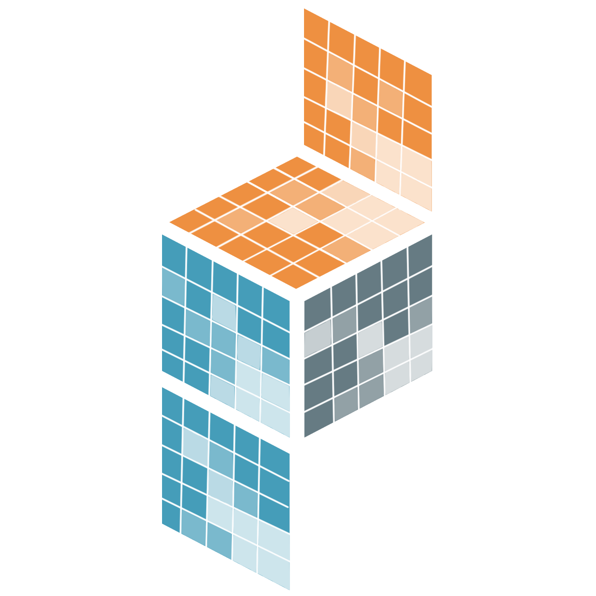

---
hide:
  - navigation
  - toc
---

# Sparse
This project implements sparse arrays of arbitrary dimension on top of
[`numpy`][] and [`scipy.sparse`][]. [`sparse.COO`][] and [`sparse.DOK`][]
generalize the [`scipy.sparse.coo_matrix`][] and
[`scipy.sparse.dok_matrix`][] layouts. [`sparse.GCXS`][] extends compressed
sparse storage beyond two dimensions: for a two-dimensional array,
compressing rows (`compressed_axes=(0,)`) corresponds to
[`scipy.sparse.csr_matrix`][], while compressing columns
(`compressed_axes=(1,)`) corresponds to [`scipy.sparse.csc_matrix`][].
 
 
{width=20%, align=left}

  {width=10%, align=left}
  <a href="introduction/" style: class="card">Introduction </a>
  { .card }

  {width=10%, align=left}
  <a href="install/" style: class="card">Install</a>
  { .card }

  {width=10%, align=left}
  <a href="examples/" class="card">Tutorials</a>
  { .card }

  {width=10%, align=left}
  <a href="how-to-guides/" class="card">How-to guides</a>
  { .card }

  {width=10%, align=left}
  <a href="api/" style: class="card">API</a>
  { .card }

 {width=10%, align=left}
  <a href="contributing" style: class="card">Contributing </a>
  { .card }

